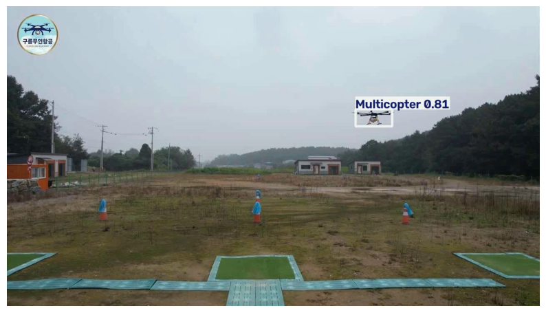

# Drone Detection & Classification using YOLOv8

A computer vision pipeline that detects drones in video/images and classifies them into four categories: **Fixed-wing, Multicopter, VTOL, and Competition drones**. Built as the first component of a larger multi-modal drone detection and localization system.

## Demo


*Model correctly detects and classifies a multicopter drone with 81% confidence.*

## Results

Fine-tuned YOLOv8n on a 4,220-image annotated drone dataset. Evaluated on a held-out test set of 127 images never seen during training.

| Metric | Score |
|---|---|
| Precision | 97.7% |
| Recall | 82.5% |
| mAP@50 | 87.8% |
| mAP@50-95 | 70.3% |
| Inference speed (GPU) | 3.9 ms/frame |

### Per-class performance (test set)

| Class | Precision | Recall | mAP@50 |
|---|---|---|---|
| Fixed-wing | 96.1% | 96.8% | 97.9% |
| Multicopter | 99.0% | 90.9% | 90.5% |
| VTOL | 97.3% | 77.8% | 80.1% |
| Competition | 98.4% | 64.7% | 82.6% |

## Tech Stack

- **Python**, **PyTorch** (via Ultralytics YOLOv8)
- **OpenCV** — video I/O, frame processing, visualization
- **Roboflow** — dataset sourcing and management
- Trained on Google Colab (Tesla T4 GPU)

## How it works

1. Dataset of 4,220 annotated drone images (train/valid/test split) sourced from Roboflow
2. YOLOv8n (pretrained on COCO) fine-tuned for 50 epochs on the drone dataset
3. Model evaluated on held-out test set for precision, recall, and mAP
4. Inference pipeline reads video frame-by-frame, runs detection, and overlays bounding boxes with class labels and confidence scores

## Limitations

- **Lower recall on the Competition class (64.7%)** compared to other classes — likely due to fewer training examples or visual similarity to other drone types. This is the model's clearest weak point.
- Trained and evaluated on a specific dataset domain (open-sky/field footage); performance on urban backgrounds, night conditions, or heavy occlusion is untested.
- Detection only — no distance, altitude, or GPS-position estimation in this version. That is planned for a future extension (see Roadmap).

## Roadmap

This is Phase 1 of a larger multi-modal drone detection and localization project. Planned extensions:
- Object tracking (Kalman filter-based trajectory smoothing)
- Camera-based bearing estimation
- Multi-model benchmarking (YOLOv8n vs YOLOv8s speed/accuracy tradeoffs)
- Sensor fusion (acoustic, RF) — longer-term research direction

## Setup

```bash
pip install -r requirements.txt
```

Run inference on your own video by loading the trained weights and following the pipeline in `notebook.ipynb`.

## Dataset

Dataset sourced from [Roboflow Universe](https://universe.roboflow.com) — Anti-drone detection dataset, CC BY 4.0 license.
