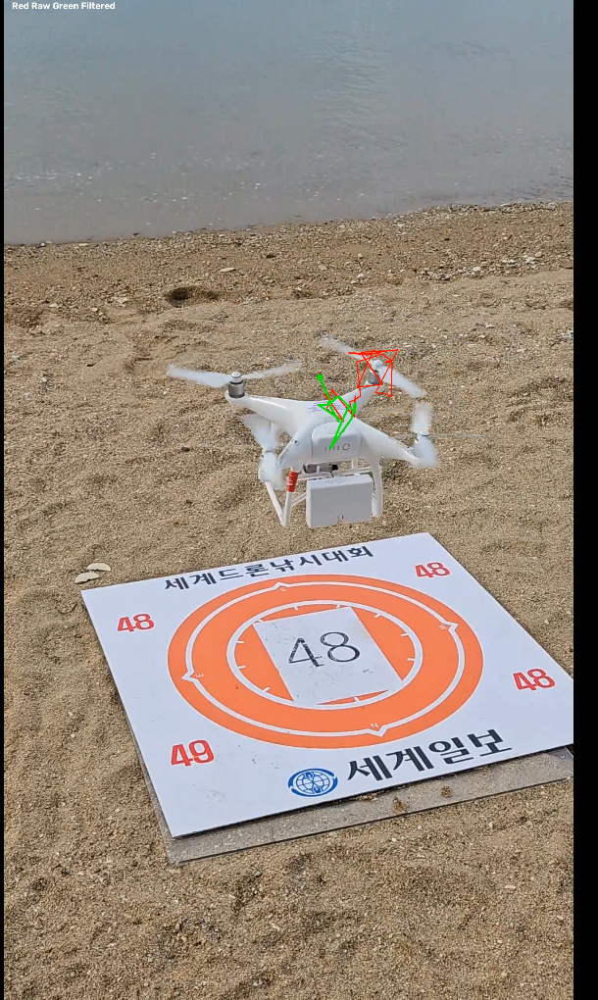

# Kalman Filter Drone Tracker

A 2D Kalman filter (implemented from scratch in NumPy) that tracks a drone's position across video frames — smoothing noisy YOLOv8 detections and predicting position through missed/occluded frames.

## Demo


*Green trail: Kalman-filtered trajectory. Red trail: raw detection positions. The filtered path stays smooth and locked onto the drone despite noisy input.*

## Results

Tested on a real 16-second drone video (989 frames, 1440x2560).

| Metric | Value |
|---|---|
| Detections after confidence + temporal gating | 752/989 (76%) |
| Raw trajectory jitter | 33.328 |
| Kalman-filtered trajectory jitter | 10.292 |
| **Jitter reduction** | **69.1%** |

Jitter is measured as mean frame-to-frame jerk (second derivative of position) — a standard way to quantify trajectory smoothness without requiring ground-truth position data.

## How it works

1. Takes raw (x, y) bounding box centers from the YOLOv8 detector ([Project 1](../project1_detection/))
2. Applies **confidence thresholding** (≥0.35) to reject low-confidence detections
3. Applies **temporal gating** — rejects any detection implying an implausible frame-to-frame jump (>150px), which catches false positives from visually similar background objects
4. Feeds cleaned detections into a constant-velocity Kalman filter, which predicts + corrects position every frame
5. When no detection is available (occlusion, missed frame), the filter continues tracking using pure prediction

## Tech Stack

Python, NumPy, OpenCV (visualization)

## Limitations

- Trail visualization shows a 30-frame history window, so it lags slightly behind the drone during fast vertical movement (e.g. landing)
- Constant-velocity motion model — does not account for sharp acceleration/maneuvering; a more advanced model (e.g. constant-acceleration or IMM) would handle aggressive flight better
- Temporal gating threshold (150px) was tuned empirically on this video; may need adjustment for different frame rates or drone speeds

## Setup

```bash
pip install numpy opencv-python
```

Run `kalman_tracker.py` on a sequence of detection centers (list of (x, y) tuples or None for missed frames).
